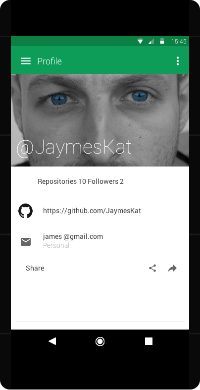
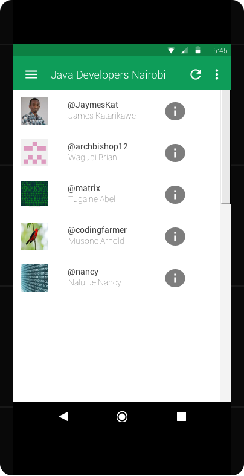

# GitHub-connect

An android application that consumes the github api.

      

## Getting Started
These instructions will get you a copy of the project up and running on your local machine for development and testing purposes.

### Prerequisites
**Java Development Kit** A [link](https://www.oracle.com/technetwork/java/javase/downloads/jdk8-downloads-2133151.html) to download the JDK.

**Android Studio** A [link](https://developer.android.com/studio/) to download android studio.

### Installing
A step by step series of examples that tell you how to get a development env running

Clone the repository. Enter command `git clone https://github.com/archbishop12/github-connect.git`

Build the application and the dependencies will be added to the project.

Start your emulator or connect your android device to the studio.

Run the project in the studio.

The application will run in the android emulator or connected device.

## Running the tests
To run the tests.
Enter the command `./gradlew lint test` to run the tests in the application.
To run with coverage `./gradlew jacocoTestReport` and a html page with coverage will br generated.

## Built With
Java

Android

## Project Mockups

